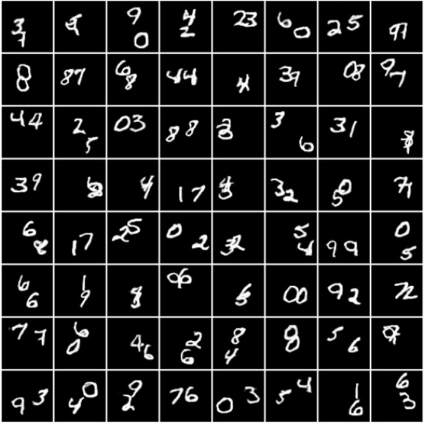
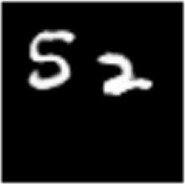

<!-- No Heading Fix -->

# MNIST Double Digit Dataset

## Overview

MNIST Double Digits (MNISTDD) dataset contains gray scale images of size 64x64. Each image has two [MNIST](http://yann.lecun.com/exdb/mnist/) digits (from 0 to 9) randomly placed inside it like this: 

The digits in these images are not taken directly from MNIST, but rather generated by a Generative Adversarial Networks trained on it.

## Data format

The MNISTDD dataset is divided in to 3 subsets: train, validation and test containing 55K, 5K and 10K samples respectively. A sample consists of:

- **Image**: A 64 x 64 image that has been vectorized to a 4096-dimensional vector.
- **Labels**: A 2-dimensional vector that has two numbers in the range [0, 9] which are the two digits in the image. Note that these two numbers are always in ascending order. For example, if digits 7 and 5 are in a image, then this two-vector will be [5, 7] and not [7, 5]
- **Bounding boxes**: A 2 x 4 matrix which contains two bounding boxes that mark locations of the two digits in the image. The first row contain location for the first digit in labels and the second row for the second one. Each row of the matrix has 4 numbers which represent **[row of the top left corner, column of the top left corner, row of the bottom right corner, column of the bottom right corner]** in the exact order. 
Note: it is always the case that row of the bottom right corner - row of the top left corner = column of the bottom right corner - column of the top left corner = 28. This means that each bounding boxes has a size of 28 x 28 no matter how large or small the digit inside that box is.

As an example, consider the following 64 x 64  image that contains the digits 5 and 2:  

 
 
- Image will be the above image but flattened to a 4096-dimensional vector. 
- Labels will be [2, 5]
- Bounding boxes will be a matrix with the first row: [11, 27, 39, 55] and the second row: [6, 2, 34, 30]. 
    - This means that the digit 2 is located between the 11th and 39th rows and between 27th and 55th columns of the image.
    - Same goes for digit 5 - it is located between the 6th and 34th rows and between 2nd and 30th columns of the image.

Each set comprises 3 `.npy` files which can each be read using `numpy.load()` to obtain the corresponding matrix stored as a  `numpy.ndarray`. Following are detailed descriptions of the 3 files where `{SET_NAME}` denotes the name of the subset (train, valid or test) and N is the number of samples:

- `{SET_NAME}_X.npy`: 2D matrix with dimension [N, 4096] and containing the vectorized images Each row is a single vectorized image.
-  `{SET_NAME}_Y.npy`: 2D matrix with dimension [N, 2] and containing the labels. Note that the labels are always in ascending order in each row.
- ` {SET_NAME}_bboxes.npy`: 3D matrix with dimension [N, 2, 4] and containing the bounding boxes. For more information, see the description of bounding boxes above.

For example, following are the dimensions of the numpy.ndarray in 3 files of the train set:

- `train_X.npy`: [55000, 4096]
- `train_Y.npy`: [55000, 2]
- `train_bboxes.npy`: [55000, 2, 4]

The test set is not released in this repo.
